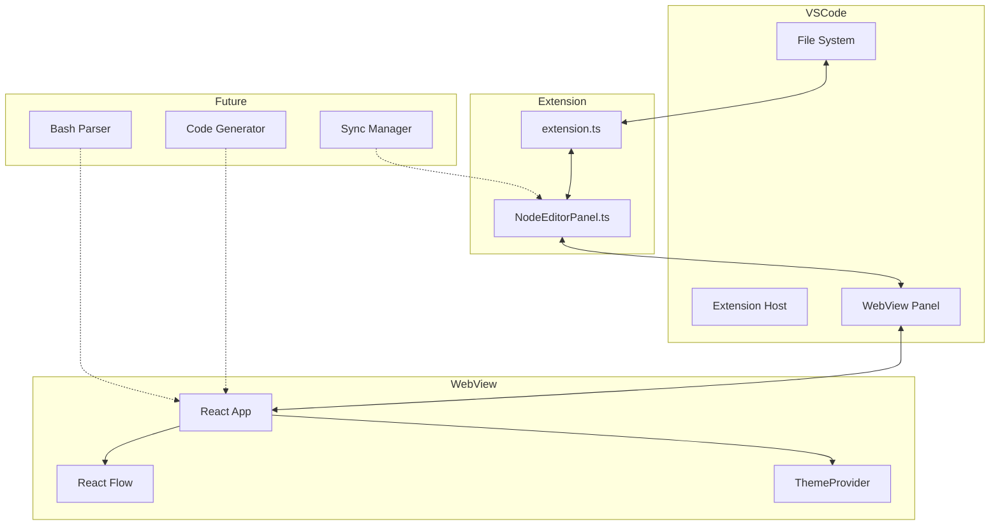

# NodeEditor アーキテクチャドキュメント

## 📐 システム全体構成



## 🏗 コンポーネント詳細

### 1. Extension層（VSCode拡張機能）

#### extension.ts
- **役割**: 拡張機能のエントリーポイント
- **責務**:
  - コマンドの登録（openEditor, importScript, exportScript）
  - ステータスバーアイテムの管理
  - 設定値の管理
  - WebViewパネルのシリアライザー登録

#### NodeEditorPanel.ts
- **役割**: WebViewパネルの管理
- **責務**:
  - WebViewパネルの作成・表示
  - HTMLコンテンツの生成
  - VSCode ⇔ WebView間のメッセージング
  - ドキュメントの変更監視
  - CSP（Content Security Policy）の設定

### 2. WebView層（React アプリケーション）

#### App.tsx
- **役割**: メインアプリケーションコンポーネント
- **責務**:
  - React Flowの統合
  - ノードとエッジの状態管理
  - VSCodeとのメッセージ通信
  - ノード操作のハンドリング

#### ThemeProvider.tsx
- **役割**: VSCodeテーマとの統合
- **責務**:
  - VSCodeテーマの検出（dark/light/high-contrast）
  - テーマ変更の監視
  - カスタムCSS変数の適用

#### reactFlowConfig.ts
- **役割**: React Flow設定
- **内容**:
  - デフォルトビューポート設定
  - ノード/エッジタイプ定義（今後拡張）
  - スタイル設定
  - デモノード定義

## 📨 メッセージング設計

### Extension → WebView
```typescript
// スクリプト内容の送信
{
    command: 'setScript',
    script: string
}

// ノード更新の送信
{
    command: 'updateNodes',
    nodes: Node[],
    edges: Edge[]
}
```

### WebView → Extension
```typescript
// スクリプト取得要求
{
    command: 'getScript'
}

// スクリプト更新
{
    command: 'updateScript',
    script: string
}

// エラー通知
{
    command: 'alert',
    text: string
}
```

## 🎨 スタイリング設計

### VSCode変数の活用
```css
/* VSCodeのテーマ変数を使用 */
--vscode-editor-background
--vscode-editor-foreground
--vscode-panel-border
--vscode-button-background
--vscode-button-foreground
--vscode-focusBorder
```

### カスタム変数定義
```css
/* ノードエディタ用カスタム変数 */
--node-bg: var(--vscode-editor-background);
--node-border: var(--vscode-panel-border);
--node-text: var(--vscode-editor-foreground);
--edge-color: var(--vscode-textLink-foreground);
```

## 🔒 セキュリティ設計

### Content Security Policy (CSP)
```html
<meta http-equiv="Content-Security-Policy" content="
    default-src 'none'; 
    style-src ${webview.cspSource} 'unsafe-inline'; 
    script-src 'nonce-${nonce}' 'unsafe-eval'; 
    img-src ${webview.cspSource} data: https:; 
    font-src ${webview.cspSource};
">
```

- `default-src 'none'`: デフォルトですべてのリソース読み込みを禁止
- `style-src`: VSCodeのスタイルとインラインスタイルを許可
- `script-src`: nonce付きスクリプトとReact用のeval許可
- `img-src`: 画像リソースの読み込み許可
- `font-src`: フォントリソースの読み込み許可

## 🔄 データフロー（現在）

```
1. ユーザーがBashファイルを開く
   ↓
2. extension.tsのopenEditorコマンドが実行
   ↓
3. NodeEditorPanel.createOrShow()でパネル作成
   ↓
4. WebViewにHTMLとReactアプリを読み込み
   ↓
5. App.tsxがVSCodeにgetScriptメッセージ送信
   ↓
6. NodeEditorPanelがsetScriptでスクリプト内容を返送
   ↓
7. App.tsxがデモノードを表示（※実際の解析は未実装）
```

## 🔮 今後の拡張ポイント

### Phase 4: Bashパーサー実装
- bash-parserライブラリの統合
- AST（抽象構文木）の生成
- エラーハンドリング

### Phase 5: 変換システム
- AST → ノードグラフ変換
- ノードグラフ → Bashスクリプト生成
- 双方向変換の整合性保証

### Phase 6: リアルタイム同期
- ファイル変更の監視
- デバウンス処理
- 競合解決メカニズム

## 📦 ビルドプロセス

### Webpack設定（2つのビルドターゲット）

1. **Extension用ビルド**
   - Target: `node`
   - Entry: `src/extension/extension.ts`
   - Output: `out/extension/extension.js`
   - TypeScript Config: `tsconfig.json`

2. **WebView用ビルド**
   - Target: `web`
   - Entry: `src/webview/index.tsx`
   - Output: `out/webview/index.js`
   - TypeScript Config: `tsconfig.webview.json`
   - 追加ローダー: style-loader, css-loader

## 🔑 設計上の重要な決定事項

1. **React Flowの採用**
   - 理由: 高度にカスタマイズ可能なノードエディタライブラリ
   - 利点: 豊富な機能、良好なドキュメント、活発なコミュニティ

2. **WebViewの使用**
   - 理由: VSCode内でリッチなUIを実現
   - 利点: React等のWebフレームワークを活用可能

3. **TypeScriptの全面採用**
   - 理由: 型安全性、IDE支援、リファクタリングの容易さ
   - 利点: バグの早期発見、開発効率の向上

4. **VSCodeテーマとの統合**
   - 理由: ユーザー体験の一貫性
   - 利点: ダーク/ライトテーマの自動対応